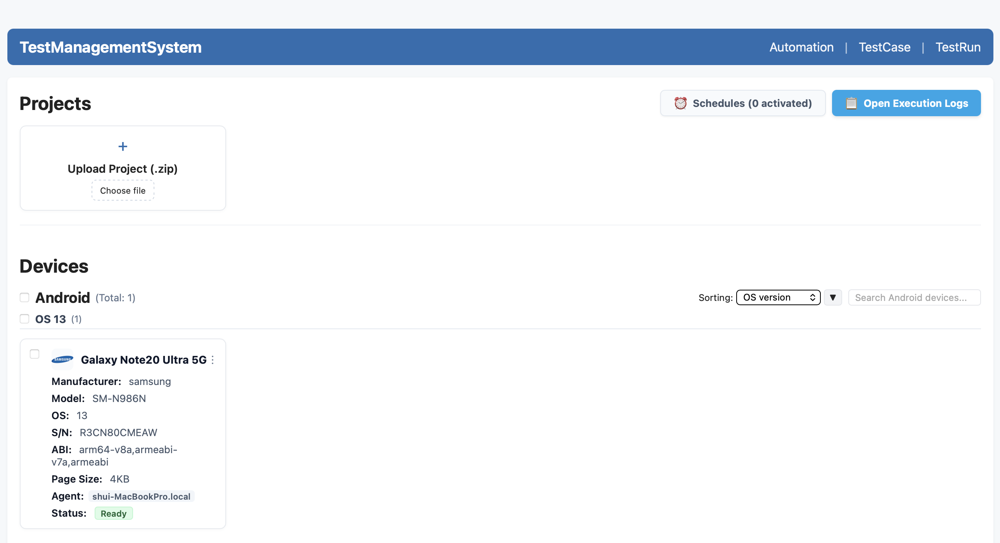
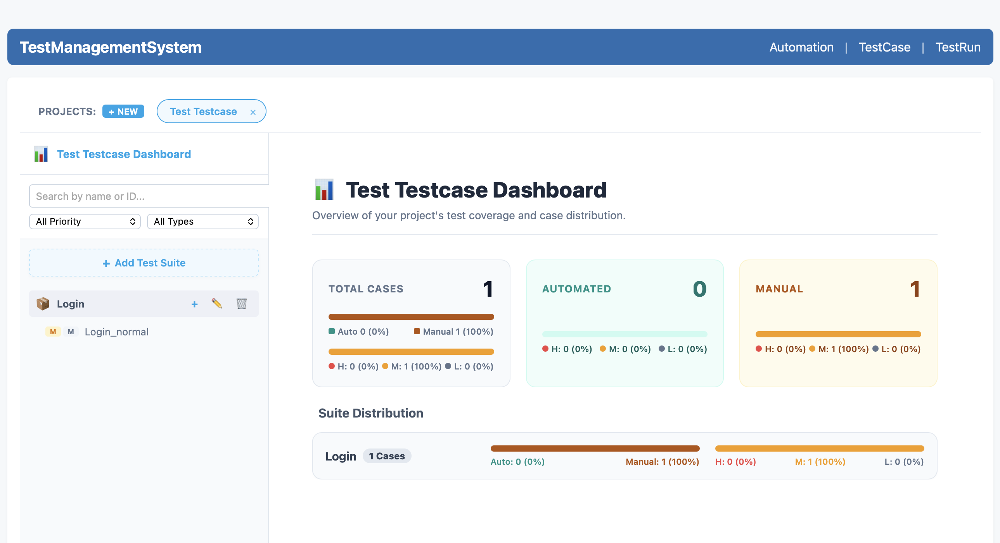
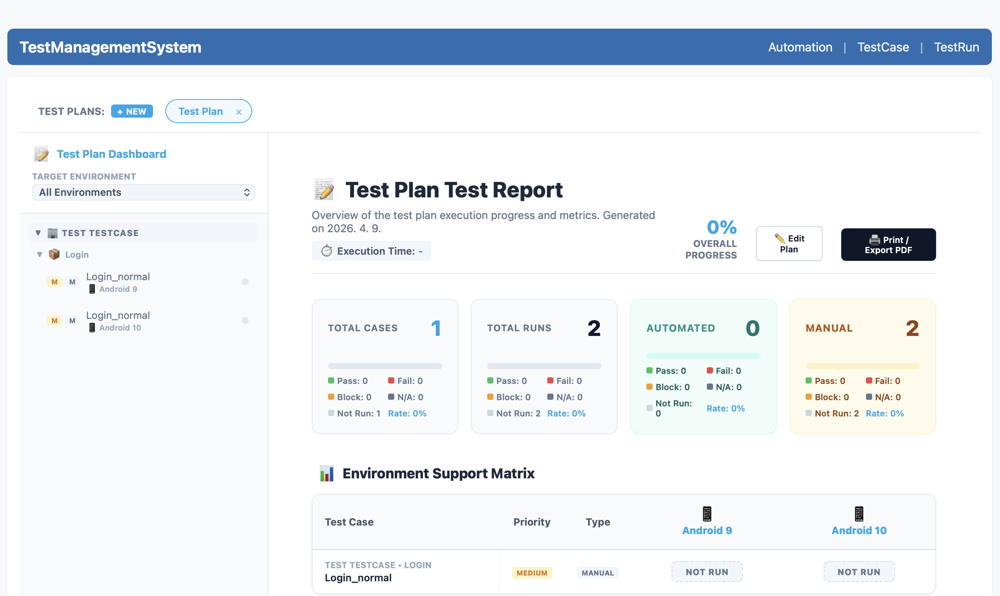
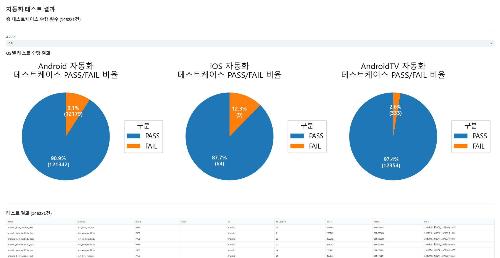
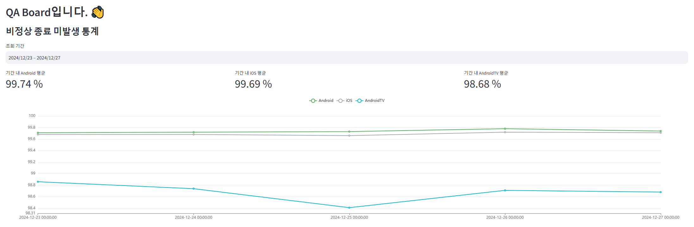
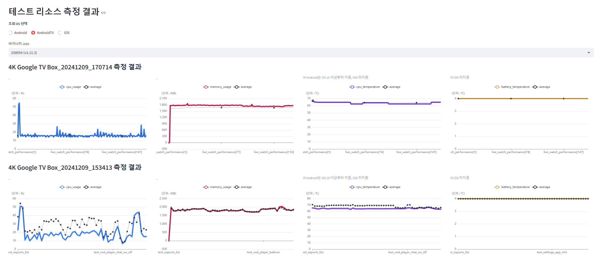

# 이력서 및 포트폴리오 (Resume & Portfolio)

## 1. 인적사항 및 소개 (Profile)

- **Name:** 정상혁
- **Birth:** 1993.05.12
- **Gender:** 남자 (Male)
- **Phone:** 010-4875-4939
- **Email:** tkdgur1798@gmail.com
- **GitHub:** [https://github.com/sanghyeok-Jung](https://github.com/sanghyeok-Jung)

> **"사용자의 시선에서 프로덕트의 사용성과 품질을 집요하게 고민하고, 개발 역량과 AI 기술을 통해 QA 인프라의 한계를 돌파하는 Technical QA입니다."**
> 
> 탄탄한 수동 테스트 역량으로 크리티컬한 비즈니스 로직과 UX를 검증하는 동시에,   풀스택 개발 경험을 살려 비개발 직군도 쉽게 사용할 수 있는 자동화 프레임워크와 디바이스 팜(Device Farm) 인프라를 구축해 왔습니다. 
> 
> 특히 AI 코딩 에이전트 등 최신 환경을 실무에 적극 도입하여 솔루션 구축 리드타임을 획기적으로 단축시키고,   압도적인 개발 생산성을 기반으로 팀 전체가 더 나은 사용자 경험에만 온전히 집중할 수 있는 진보된 테스트 생태계를 만듭니다.

## 2. 기술 스택 (Tech Stack)

- **Frontend:** HTML, JavaScript, TypeScript, React
- **Backend:** Node.js, Python, FastAPI, Java, Spring
- **Database:** MySQL, MariaDB, PostgreSQL
- **Tools & Collaboration:** Git, Jira, Figma

## 3. 경력 정보 (Work Experience)

> **총 경력: 6년 5개월** (2026년 4월 기준)

### 도브러너
- **직무:** Android QA Engineer (AppSecurity 팀)
- **기간:** 2025.04 - 현 직장(재직중)
- **주요 내용:** 
  - **보안 애플리케이션 품질 검증 (Android 및 웹)**
    - Android 모바일 앱과 웹 기반 AppSecurity 프로덕트 대상 수동 테스트 기획 및 수행
    - 플랫폼별(모바일/웹) 환경을 아우르는 자동화 테스트 스크립트 개발 및 정기 검증 수행
  - **사내 테스트 관리 시스템(Test Management System, TMS) 풀스택 설계 및 구축**
    - 사내 QA 환경 자동화 및 통합 관리를 위해 Python(Flask) 기반 백엔드와 React 프론트엔드를 결합한 시스템 자체 풀스택 설계 및 개발
    - **에이전트(Agent) 기반 디바이스 팜(Device Farm) 인프라 구현:** 에이전트 시스템 구조를 채택하여 다수의 물리 디바이스를 분산 연결하고, 이를 중앙에서 실시간으로 원격 제어(Remote Control)하는 디바이스 팜 환경 통합 구축
    - **종합 테스트 관리 환경 구축 (TC, Plan, Execution):** 통합된 웹 인터페이스에서 자체적으로 테스트 케이스(Test Case) 생성 및 이력 관리, 대규모 테스트 계획(Test Plan) 수립 및 그룹 단위 실행 제어 기능 풀스택 구현
    - **동적 UI 연동 및 파이프라인 자동화:** Python `argparse` 옵션을 파싱하여 프론트엔드단에 동작 스크립트 실행 UI(Dropdown, Input 등)를 맞춤형으로 자동 생성하고, 일일 스케줄러 예약 실행을 지원하는 유연한 시스템 설계
    - 기획 및 개발 초기부터 AI 코딩 에이전트를 페어 프로그래밍 파트너로 적극 도입하여 개발 리드타임을 획기적으로 줄이고 고도화된 아키텍처 완성
  - **🔗 직접 구축한 디바이스팜 및 종합 테스트 환경 (스크린샷):**
     
    
    
    

### 숲 (SOOP)
- **직무:** QA Engineer (모바일 QA 팀)
- **기간:** 2023.05 - 2025.01
- **주요 내용:** 
  - **멀티 플랫폼 품질 및 핵심 비즈니스 로직 검증 (Android, iOS, AndroidTV)**
    - Android, iOS 모바일 앱 및 AndroidTV 앱 환경에 맞춘 기능 테스트(Functional Test) 시나리오 설계 및 수행
    - 인앱 결제 시스템 등 크리티컬한 비즈니스 로직 안정성 검증 및 로그 트래킹 타겟 테스트 설계
    - 다양한 OS 및 플랫폼 크로스 환경에서의 호환성 및 프로덕트 품질 검증
  - **UI 자동화 테스트 프레임워크 설계 및 도입 주도**
    - 모바일 앱 UI 자동화 테스트 환경 구축 및 핵심 스크립트 개발 파트 리딩
    - 코딩 지식이 없는 비개발직군 QA 팀원도 손쉽게 자동화 시나리오를 개발하고 수행할 수 있도록 추상화된 테스트 구조 자체 설계 및 구축
    - 자동화 테스트 실행 파이프라인에 Android 디바이스 성능 프로파일링(CPU 사용률, CPU/배터리 온도, RAM 사용량 등) 측정 로직을 통합하여 실시간 성능 저하 요인 탐지
    - 로컬 데이터베이스(DB) 연동으로 테스트 결과를 자동화 수집하고, 전용 웹 대시보드를 직접 개발하여 비개발자도 직관적으로 결과 리포트를 확인할 수 있도록 사내 인프라 조성
    - 팀 전체의 자동화 도입 진입 장벽을 낮추어 테스트 커버리지 확대 및 리소스 효율화 달성
  - **🔗 포트폴리오 첨부 자료**
    - **자동화 성과 달성 발표 자료:** [2023년 성과 발표(.pdf)](https://github.com/sanghyeok-Jung/sanghyeok-jung.github.io/blob/master/resources/2023_automation_achievements.pdf?raw=true) | [2024년 성과 발표(.pdf)](https://github.com/sanghyeok-Jung/sanghyeok-jung.github.io/blob/master/resources/2024_automation_achievements.pdf?raw=true)
    - **직접 구축한 QA 대시보드 뷰 (테스트 결과, 크래시, 성능 종합 리포트):**
       
      
      
      

### 아이엔소프트
- **직무:** 풀스택 웹 개발자 (클라우드 개발 본부)
- **기간:** 2022.03 - 2023.04
- **주요 내용:** 
  - **클라우드 기반 웹 서비스 개발 (React & Spring Boot)**
    - React를 활용한 프론트엔드 UI 화면 구현 및 동적 상태 관리 로직 작성
    - Spring Boot(Java) 기반의 백엔드 비즈니스 로직 및 REST API 개발
  - **개발 지식을 통한 Technical QA 역량의 코어 베이스 확보**
    - 프론트/백엔드/DB 생태계 전반을 아우르는 개발 실무 경험 확보
    - 이때 체득한 시스템 아키텍처 및 데이터베이스, 애플리케이션 구조에 대한 높은 이해도가 추후 '로컬 DB 연동 및 웹 대시보드 구축(숲)', '사내 TMS 풀스택 개발(도브러너)'과 같은 기술 주도적인 차세대 QA 퍼포먼스로 직결되는 핵심 기반으로 작용함

### 넥슨네트웍스
- **직무:** QA Engineer (모바일 게임 QA팀)
- **기간:** 2017.12 - 2020.04
- **주요 내용:** 
  - **모바일 게임 신규 런칭 리딩 및 인앱 결제/기능 검증**
    - 3인 규모 QA 스쿼드의 리드로서 신규 모바일 게임 런칭을 성공적으로 주도
    - Android/iOS 환경에서의 결제(BM) 시스템 및 코어 기능에 대한 수동 테스트(Manual Test) 설계 및 수행
  - **VBA 매크로 기반 확률형 아이템 검증 자동화 및 사내 수상**
    - 코딩 지식을 선제적으로 활용하여 Excel VBA 기반의 확률형 아이템 검증 자동화 매크로 자체 개발
    - 대량의 로그와 확률 데이터 검증을 자동화하여 휴먼 에러를 방지하고 테스트 소요 리소스를 크게 단축
    - 해당 업무 효율화 성과를 인정받아 사내 '모바일 QA실 올해의 시도 상' 수상

## 4. 개인/팀 프로젝트 (Projects)

### 🚀 Test Management System (QA Lab Orchestrator)
> 다수의 물리적 모바일 디바이스 팜(Device Farm)을 중앙에서 통합 관리하고, 분산 테스트를 오케스트레이션하는 풀스택 솔루션 자체 개발
- **형태:** 개인 토이 프로젝트 (AI 코딩 에이전트 활용)
- **사용 기술:** 
  - **Frontend:** React 18, Vite, Tailwind CSS, Radix UI
  - **Backend & Network:** Node.js, Fastify, Socket.IO
  - **Architecture:** 터보레포(Turborepo) 모노레포
  - **Device Control:** Android (ADB), iOS (WebDriverAgent, go-ios), 원격 PTY Shell
- **주요 구현 내용:**
  - **실시간 디바이스 원격 제어 및 미러링:** Android(H.264 화면 스트리밍) 및 iOS(MJPEG 스트리밍) 테스트 기기를 웹 브라우저에서 실시간으로 화면 송출하고 터치/이벤트를 제어하도록 구현
  - **분산형 에이전트(Agent) 아키텍처:** 호스트 PC용 Agent 모듈을 개발하여 연결된 물리 기기들을 중앙 서버와 실시간 Socket.io 통신으로 바인딩하는 분산 시스템 설계
  - **테스트 파이프라인 및 잡(Job) 스케줄링:** Cron 기반의 테스트 스크립트 예약 실행, 패키지(APK/IPA/AAB) 원격 설치, Native Node 및 ADB Shell 제어 등 QA 인프라 핵심 기능 제공
  - **AI 코딩 기반 생산성 혁신:** 기획 단계부터 아키텍처, 기능 구현까지 풀스택 전 과정을 AI 코딩 파트너와 함께 개발하여 최신 기술 스택으로 단기간에 솔루션 구축
- **GitHub:** [https://github.com/sanghyeok-Jung/TestManagementSystem](https://github.com/sanghyeok-Jung/TestManagementSystem)

## 5. 학력 및 자격 (Education & Certificates)

### 🎓 학력 및 병역 (Education & Military)
- **인덕대학교** (Induk University)
  - **전공:** 컴퓨터소프트웨어학과 (전공 심화 과정 이수)
  - **학위:** 4년제 학사 학위 (Bachelor's Degree)
  - **기간:** 2012.03 - 2018.02
- **병역** (Military Service)
  - **구분:** 육군 만기 전역
  - **기간:** 2013.02 - 2014.11

### 📚 교육 이수 (Training & Courses)
- **그린컴퓨터아카데미**
  - **과정명:** 자바 & 스프링(Spring) 프레임워크 개발자 양성 과정
  - **기간:** 2020.06 - 2020.12

### 📜 보유 자격증 (Certifications)
- **정보처리기사** (2020.11)
- **ISTQB Foundation Level** (2018.07)
- **정보처리산업기사** (2016.07)
- **네트워크관리사 2급** (2012.12)
- **정보기술자격(ITQ) 한글** (2011.10)
- **정보기술자격(ITQ) 파워포인트** (2011.10)
- **정보기술자격(ITQ) 엑셀** (2011.06)
